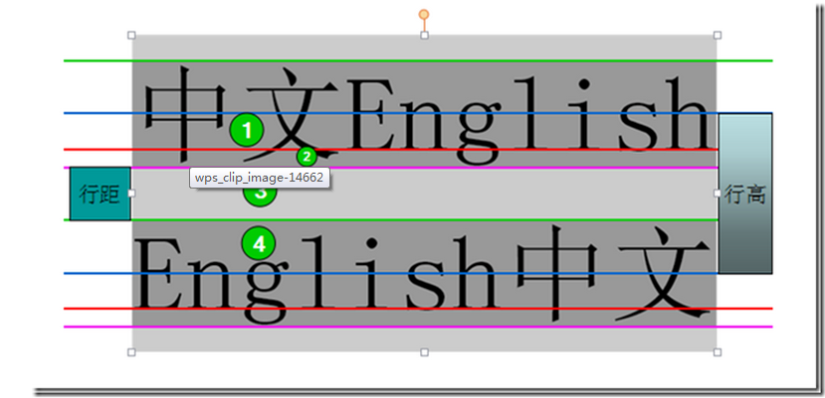

# About calendar

## 1. CSS

**`vertical-align`**

> 其实`vertical-align`是用来设置`行内元素`对齐方式的。就是来设置一行元素不同大小字体，图片与字体之间基准线的对齐方式；

**基线概念**

> 基线就是元素倒数第二根基准线；
>
> 
>
> 这张图从上到下是顶线、中线、基线、底线；
>
> 其实基线的位置一直不固定。
>
> - 在文本之类内联元素中，基线是字符x的下边缘位置
>
> - 在像`img`元素中基线就是下边缘。
>
> - 在`inline-block`元素中，也分两种情况
>
>   -  如果该元素中有内联元素，基线就是最后一行内联元素的基线。
>
>   -  如果该元素内没有内联元素或者overflow不是visible，其基线就是margin的低边缘。
>
> 实际上行内元素的对齐，是以基线来进行对齐。
>
> 通过设置`vertical-align`属性来设置`inline`或`inline-block`元素的基线；

```css
.inline-box{
    vertical-align:middle | bottom | top;
}
```

****

**`display:inline-block`**

> 定义对象为内联块元素；

- 内联块元素：有`height`,`width`的概念，但属于行内元素；


****

**`line-height`**

> **设置对象的行高。即字体最底端与字体内部顶端之间的距离。**

暂时理解为定义顶线和底线的距离，内容会被居中，会被行间距会被增大；而顶线和底线的距离是以一行最大的元素来设定的；

## 2. `javascript`

**`elem.classList`**

> DOM有两种查看和设置元素class的方式
>
> 1. `elem.className`
> 2. `elem.classList`
>
> 第二种方式显得更加灵活，方便

`elem.claasList`会生成一个`DOMTokenList` like Array形式；

这个对象包括一些class，我们可以对他元素的class进行操作；

- `elem.classList.add/remove(class)` — 添加/移除类。
- `elem.classList.toggle(class)` — 如果类不存在就添加类，存在就移除它。
- `elem.classList.contains(class)` — 检查是否包含类，返回 `true/false`。

****

**new Date()**

> 不带参数 —— 创建一个表示当前日期和时间的 `Date` 对象：

**访问Date对象的方法**

```js
let date = new Date();
date.getFullYear();
date.getMonth();
date.getDate(); //获取当月的具体日期
date.getDay(); //获取一周中的第几天
date.getHours();
date.getMinutes();
date.getSeconds();
date.getMilliseconds();
date.getTime() //返回日期的时间戳
```

****

**`document.querySelector`**

**`docuemnt.querySelectorAll`**


